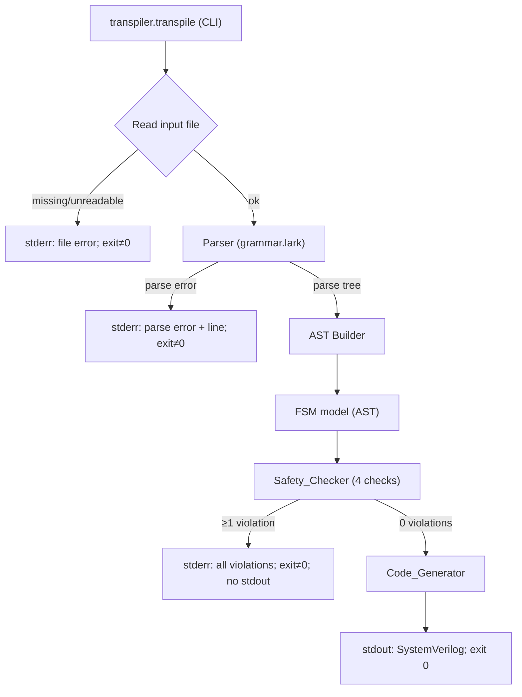

# Design Document

## Overview

This design describes **FSM_DSL v0.1**, a minimal Moore-only finite state machine language, and its companion **Transpiler**: a frozen Python 3.12 program that parses FSM_DSL source, enforces compile-time safety rules, and emits lint-clean, latch-free, synthesizable SystemVerilog in the canonical three-always-block style.

The central design principle is **correctness by construction**. Rather than asking authors (human or model) to avoid the low-level Verilog mistakes that LLMs repeatedly make — inferred latches, blocking/non-blocking misuse, reset bugs, hand-rolled state encodings, multiple drivers — the language makes those mistakes *inexpressible*, and the transpiler centralizes every code-generation decision so the hazards cannot reappear in output. The author writes *what* the machine does (states, outputs, transitions); the transpiler owns *how* it becomes hardware (encoding, clocking, reset, block structure).

Scope is **Phase 1 (design the language)** and **Phase 2 (build and freeze the transpiler)**. It explicitly excludes any RL loop, model training/inference, and benchmark harness. The deliverable boundary is: language spec written, transpiler built, validated against golden SystemVerilog by an automated harness, and frozen via `FROZEN.md`.

The pipeline is a classic compiler front-to-back flow with a hard gate between safety analysis and code generation:

```
INPUT.fsm ──▶ Parser (lark) ──▶ AST ──▶ Safety_Checker ──▶ [gate] ──▶ Code_Generator ──▶ OUTPUT.sv
                  │                          │                              
              parse error              safety errors                  
              (stderr, exit≠0)        (stderr, exit≠0, no stdout)      
```

The gate is absolute: if any safety check reports a violation, **no SystemVerilog is written to stdout** and the process exits non-zero. Code generation runs only on an AST that has passed all four safety checks (total outputs, total transitions, name resolution, single driver).

### Key Design Decisions

| Decision | Rationale |
|----------|-----------|
| `lark` as the only parsing dependency | Requirement 15.2 forbids any parsing/HDL library beyond `lark` + stdlib. A grammar-driven parser gives unambiguous parsing (Req 5.2) and precise location-bearing errors. |
| Run **all four** safety checks to completion before generation | Req 16.1 and the "report every violation" criteria (9.4, 7.3, 10.5) require accumulating diagnostics rather than failing fast. |
| Transpiler owns state encoding, clock, reset | Reqs 3, 13 — authors cannot hand-roll the constructs that cause the most common bugs. |
| Three-always-block Moore template with mandatory defaults | Reqs 11, 12 — structural template guarantees latch-free combinational logic regardless of input program. |
| Behavioral (co-simulation) equivalence, not textual diff | Req 17.3 — trust output behavior, not formatting. |
| Freeze via `FROZEN.md` after a green harness | Req 21 — pin the transpiler so later language experiments are not confounded by transpiler drift. |

## Architecture

The transpiler is a single Python package, `transpiler`, organized as a linear pipeline of pure-ish stages plus a thin CLI shell that handles I/O and exit codes.



### Stage Responsibilities

1. **CLI shell (`transpiler/transpile.py`)** — Argument validation (exactly one positional arg, Req 15.6), file reading (Req 15.7), and mapping internal results to stdout/stderr/exit codes (Req 15.4, 15.8, 16.x). Contains no language logic itself.

2. **Parser (`transpiler/grammar.lark` + lark loader)** — Tokenizes (comment stripping per Req 4.1–4.3, closed keyword set per Req 4.4–4.5) and produces a parse tree. Rejects any construct outside the seven defined ones (Req 1.13, 4.7) and any synonym/alternative syntax (Req 4.6–4.7).

3. **AST Builder (`transpiler/ast.py`)** — A lark `Transformer` that turns the parse tree into a typed in-memory model (`Machine`, `Port`, `State`, `Transition`, `OutputAssignment`), attaching source locations to every node and validating the type grammar `bit` / `bit[H:L]` (Req 2).

4. **Safety_Checker (`transpiler/safety.py`)** — Four independent checks, each producing a list of `SafetyError`. The driver runs all four, concatenates diagnostics, and reports the aggregate (Req 16.1). Checks: total outputs (Req 7), total transitions (Req 8), single driver (Req 9), name resolution (Req 10).

5. **Code_Generator (`transpiler/codegen.py`)** — Emits the three-always-block module from a validated `Machine`: `enum logic` state type (Req 13.1–13.3), `always_comb` next-state and output blocks with mandatory defaults (Req 11, 12), `always_ff @(posedge clk)` sequential block with synchronous reset (Req 13.4–13.6).

### Module Layout

```
transpiler/
  __init__.py
  transpile.py        # CLI entry: python -m transpiler.transpile INPUT.fsm
  grammar.lark        # FSM_DSL grammar (Req 15.5)
  ast.py              # AST node dataclasses + lark Transformer
  safety.py           # Safety_Checker: 4 checks + driver
  codegen.py          # Code_Generator: three-always emitter
  errors.py           # CompileError hierarchy with source locations
spec/
  LANGUAGE_SPEC.md    # Language_Spec (Req 5)
examples/
  seq_detect_101.fsm  # Req 6.1
  traffic_light.fsm   # Req 6.2
  handshake.fsm       # Req 6.3
golden/
  seq_detect_101.sv
  traffic_light.sv
  handshake.sv
tests/
  test_transpiler.py  # Test_Harness (Reqs 17–20)
FROZEN.md             # Frozen_Record (Req 21)
pyproject.toml        # uv-managed, python 3.12, deps: lark
```

## Components and Interfaces

### CLI (`transpiler/transpile.py`)

```python
def main(argv: list[str]) -> int:
    """Entry point. Returns process exit code.
    - len(positional) != 1  -> stderr usage, return 2          (Req 15.6)
    - file unreadable        -> stderr file error, return 1     (Req 15.7)
    - parse failure          -> stderr parse error+line, ret 1  (Req 15.8, 16.4)
    - safety violations      -> stderr all violations, ret 1    (Req 16.2, 16.3)
    - success                -> stdout SystemVerilog, return 0  (Req 15.4, 16.5)
    On any non-zero return, nothing is written to stdout.
    """
```

The CLI is the only component permitted to touch `sys.stdout`, `sys.stderr`, and process exit codes. All lower stages communicate via return values and raised `CompileError`s.

### Parser

The parser is constructed from `grammar.lark` using lark in `lalr` mode for unambiguous parsing (Req 5.2). Interface:

```python
def parse(source: str) -> ParseTree:
    """Raise ParseError(line, column, message) on grammar failure (Req 15.8)."""
```

Grammar highlights:
- Line comments: `COMMENT: /#[^\n]*/` ignored by the lexer, but never inside string/quoted tokens (Req 4.1–4.2). Comment removal does not alter the token stream (Req 4.3).
- Keywords `machine in out reset state when else` are reserved terminals, matched case-sensitively (Req 4.4–4.5).
- Exactly one syntactic form per construct; no alternative rules (Req 4.6).

### AST Builder

```python
def build_ast(tree: ParseTree) -> Program:
    """Transform parse tree into typed model with source locations.
    Validates type tokens (bit / bit[H:L]) and index constraints (Req 2.2, 2.5, 2.6)."""
```

### Safety_Checker

```python
def check(program: Program) -> list[SafetyError]:
    """Run all four checks to completion; return the aggregated list.
    Empty list means the program is safe to generate (Req 16.1, 16.5)."""

def check_total_outputs(m: Machine) -> list[SafetyError]   # Req 7
def check_total_transitions(m: Machine) -> list[SafetyError] # Req 8
def check_single_driver(p: Program) -> list[SafetyError]    # Req 9
def check_name_resolution(m: Machine) -> list[SafetyError]  # Req 10
```

Each check is independent and side-effect free; it reads the model and returns diagnostics. The driver guarantees all checks run even if earlier ones produce errors, satisfying "report every violation" (Reqs 7.3, 9.4, 10.5).

### Code_Generator

```python
def generate(m: Machine) -> str:
    """Emit SystemVerilog for a validated machine. Precondition: check() returned [].
    Produces exactly three procedural blocks (Req 11.1)."""
```

The generator is template-driven. State width is computed as `max(1, ceil(log2(N)))` (Req 13.2). Every combinational block opens by assigning defaults to all of its targets (Req 11.6, 12.1); every `case` has a single `default:` arm assigning all signals (Req 12.2).

## Data Models

The AST is a small set of frozen dataclasses. Every node carries a `Loc` (file, line, column) for error reporting.

```python
@dataclass(frozen=True)
class Loc:
    file: str
    line: int
    column: int

@dataclass(frozen=True)
class PortType:
    high: int          # for `bit`, high == low == 0  (width 1)
    low: int
    # invariant: high >= low >= 0 ; width == high - low + 1   (Req 2.2)
    @property
    def width(self) -> int: return self.high - self.low + 1

@dataclass(frozen=True)
class Port:
    direction: str     # "in" | "out"
    type: PortType
    name: str
    loc: Loc

@dataclass(frozen=True)
class Value:
    # an output assignment value; width must be consistent with the output type
    bits: int          # non-negative integer literal
    loc: Loc

@dataclass(frozen=True)
class OutputAssignment:
    output_name: str
    value: Value
    loc: Loc

@dataclass(frozen=True)
class Condition:
    # parsed guard expression for `when COND -> STATE`
    text: str          # normalized expression over input ports
    loc: Loc

@dataclass(frozen=True)
class Transition:
    kind: str          # "when" | "else"
    condition: Condition | None  # None iff kind == "else"
    target: str        # State_Target name
    loc: Loc

@dataclass(frozen=True)
class State:
    name: str
    outputs: tuple[OutputAssignment, ...]
    transitions: tuple[Transition, ...]   # last element must be kind == "else" (Req 8.1)
    loc: Loc

@dataclass(frozen=True)
class Machine:
    name: str
    inputs: tuple[Port, ...]       # excludes implicit clk/rst (Req 3.1)
    outputs: tuple[Port, ...]
    reset_state: str               # from `reset = STATE`
    states: tuple[State, ...]
    loc: Loc

@dataclass(frozen=True)
class Program:
    machines: tuple[Machine, ...]  # exactly one for valid input (Req 1.2, 1.3)
    source_file: str
```

### Model Invariants

These invariants are *established by the parser/AST builder* (structural) or *verified by the Safety_Checker* (semantic):

- **Structural (parser/AST):** exactly one machine per file; type indices satisfy `H ≥ L ≥ 0`; `clk`/`rst` not author-declared; only the seven constructs present.
- **Semantic (safety checker):** every output assigned in every state; every state ends in `else -> STATE`; every transition/reset target resolves; each output driven by exactly one machine.

### SystemVerilog Output Model

The generator emits a fixed shape per machine:

```systemverilog
module NAME (
    input  logic clk,
    input  logic rst,
    input  logic [..] <each declared input>,
    output logic [..] <each declared output>
);
    typedef enum logic [W-1:0] { S0, S1, ... } state_t;   // Req 13.1–13.2
    state_t state, next_state;                            // Req 13.3

    always_comb begin                                     // next-state block (Req 11.1, 11.3)
        next_state = state;                               // default (Req 11.6, 12.1)
        case (state)
            S0: begin if (cond) next_state = ...; else next_state = ...; end
            ...
            default: next_state = state;                  // single default arm (Req 12.2)
        endcase
    end

    always_comb begin                                     // output block (Moore: state only, Req 11.1)
        <out> = '0;                                       // defaults for all outputs (Req 12.1)
        case (state)
            S0: begin <out> = ...; end
            ...
            default: begin <out> = '0; end                // assigns all outputs (Req 12.2)
        endcase
    end

    always_ff @(posedge clk) begin                        // sequential block (Req 11.2, 13.4)
        if (rst) state <= RESET_STATE;                    // synchronous, active-high (Req 13.5–13.6)
        else     state <= next_state;
    end
endmodule
```

Only the `always_ff` block uses `<=`; only `always_comb` blocks use `=` (Reqs 11.2–11.4).

## Correctness Properties

*A property is a characteristic or behavior that should hold true across all valid executions of a system — essentially, a formal statement about what the system should do. Properties serve as the bridge between human-readable specifications and machine-verifiable correctness guarantees.*

The properties below are derived from the prework analysis. Each is universally quantified and references the acceptance criteria it validates. They fall into three families: **parser correctness** (round-trip, comment invariance, case sensitivity), **safety-checker correctness** (totality, transitions, single driver, name resolution, diagnostic completeness), and **generator correctness** (structure, encoding, reset, latch-freedom, lint-cleanliness). Properties that require external tools (verilator/yosys) are still expressed as properties but are run at a reduced iteration count in the test strategy due to tool cost.

### Property 1: Parse round-trip is identity

*For any* valid FSM_DSL program, building its AST, pretty-printing that AST back to FSM_DSL source, and parsing the result SHALL yield an AST equivalent to the original (the grammar admits exactly one parse per program).

**Validates: Requirements 5.2**

### Property 2: Comments do not affect tokenization

*For any* valid FSM_DSL source, the token stream (and resulting AST) produced from the source SHALL be identical to the token stream produced from the same source with all `#`-to-end-of-line comments removed, while a `#` inside a quoted token SHALL remain a literal character.

**Validates: Requirements 4.1, 4.2, 4.3**

### Property 3: Keywords are case-sensitive

*For any* keyword from the closed set {`machine`, `in`, `out`, `reset`, `state`, `when`, `else`}, a token that matches its spelling but differs in letter case placed in keyword position SHALL NOT be treated as that keyword and SHALL produce a parse error.

**Validates: Requirements 4.4, 4.5**

### Property 4: Exactly one machine yields exactly one module; otherwise rejection

*For any* source program, transpilation SHALL emit exactly one SystemVerilog module if and only if the program declares exactly one machine; a program declaring zero or more than one machine SHALL produce a compile-time error, write nothing to standard output, and exit non-zero.

**Validates: Requirements 1.2, 1.3**

### Property 5: Vector width matches the declared index range

*For any* port declared `bit[H:L]` with valid indices (`H ≥ L ≥ 0`), the generated SystemVerilog signal SHALL span indices H down to L with width `H − L + 1`; a port declared `bit` SHALL generate a width-1 signal.

**Validates: Requirements 2.2, 2.3, 2.4**

### Property 6: Invalid types are rejected without emitting a signal

*For any* port type token that is neither `bit` nor a well-formed `bit[H:L]` with `H ≥ L ≥ 0` integer indices (including `H < L`, negative, or non-integer indices, and any unrecognized type token), the declaration SHALL be rejected with an error and no SystemVerilog signal SHALL be emitted for that port.

**Validates: Requirements 2.5, 2.6**

### Property 7: Reserved clock/reset names are rejected; valid machines gain clk and rst

*For any* program, declaring a port named exactly `clk` or `rst` SHALL produce a compile-time error naming the reserved identifier and leave the source unmodified with no module emitted; and *for any* program with no reserved-name violation, the generated module SHALL include `clk` and `rst` as input ports without author declaration.

**Validates: Requirements 3.2, 3.3, 3.4**

### Property 8: Duplicate state names are rejected

*For any* machine in which two or more states share a name, the Safety_Checker SHALL report a compile-time error naming the duplicated state and emit no module.

**Validates: Requirements 1.9**

### Property 9: Total-outputs diagnostics are exact

*For any* machine, the Safety_Checker SHALL report exactly one error of the form `state S does not assign output 'x'` for each (state, declared output) pair where the state does not assign that output, and SHALL report zero total-outputs errors when every declared output is assigned in every declared state.

**Validates: Requirements 7.1, 7.2, 7.3, 7.6**

### Property 10: Every state must end with a final else transition

*For any* machine, the Safety_Checker SHALL report exactly one error per declared state whose transition list does not end with a final `else -> STATE` clause, naming each offending state, and SHALL report zero such errors when every state ends with a final `else -> STATE`.

**Validates: Requirements 8.1, 8.2, 8.3**

### Property 11: Every transition and reset target resolves to a declared state

*For any* machine, the Safety_Checker SHALL report exactly one name-resolution error for each transition `State_Target` (including `else -> STATE` targets) and for the `reset = STATE` target that does not match a declared state, naming each unresolved target, and SHALL report zero name-resolution errors when every target and the reset state resolve.

**Validates: Requirements 8.4, 10.1, 10.2, 10.3, 10.4, 10.5, 10.6**

### Property 12: Each output is driven by exactly one machine

*For any* program, the Safety_Checker SHALL report a single-driver error for each output that is assigned within a state of a machine other than the one declaring it, and for each output declared by more than one machine, reporting every such violation (not stopping at the first) with the offending output name and source location(s).

**Validates: Requirements 9.1, 9.2, 9.3, 9.4**

### Property 13: All safety checks run to completion and every violation is reported

*For any* program containing violations spanning more than one safety rule, the Transpiler SHALL run all four checks before emitting any SystemVerilog and SHALL report a diagnostic for every rule that is violated, rather than stopping at the first violated rule.

**Validates: Requirements 16.1**

### Property 14: Any rejected program produces empty stdout and a non-zero exit

*For any* input that fails parsing or any safety check, the Transpiler SHALL write nothing to standard output and terminate with a non-zero exit status; *for any* input that parses and passes all four safety checks, the Transpiler SHALL write SystemVerilog to standard output and terminate with a zero exit status.

**Validates: Requirements 15.4, 15.8, 16.2, 16.3, 16.5**

### Property 15: Parse-failure diagnostics carry a line number

*For any* input that fails to parse against the FSM_DSL grammar, the error written to standard error SHALL identify the line number of the failure.

**Validates: Requirements 15.8, 16.4**

### Property 16: CLI argument arity is enforced

*For any* invocation whose positional argument count is not exactly one, the Transpiler SHALL write a usage error to standard error, write nothing to standard output, and exit non-zero.

**Validates: Requirements 15.6**

### Property 17: Generated module has exactly three procedural blocks with separated assignment operators

*For any* valid machine, the generated module SHALL contain exactly three procedural blocks — two `always_comb` blocks and one `always_ff @(posedge clk)` block — where non-blocking assignments (`<=`) occur only in the `always_ff` block, blocking assignments (`=`) occur only in `always_comb` blocks, and no single block contains both operators.

**Validates: Requirements 11.1, 11.2, 11.3, 11.4**

### Property 18: Combinational blocks assign defaults to all targets and cases have one total default arm

*For any* valid machine, each generated `always_comb` block SHALL assign a default value to every signal it targets before any conditional statement, and each generated `case` statement SHALL contain exactly one `default:` arm that assigns every signal assigned in any other arm of that case.

**Validates: Requirements 11.6, 12.1, 12.2**

### Property 19: State type is an enum whose members are exactly the declared states with correct width

*For any* valid machine with N declared states, the generated module SHALL declare a single `enum logic` state type whose members are exactly the N declared state names (no more, no fewer), sized to `max(1, ceil(log2(N)))` bits, and SHALL declare the state and next-state signals with that type using no hand-written integer or bit-vector literal state codes.

**Validates: Requirements 13.1, 13.2, 13.3**

### Property 20: Reset logic is synchronous, active-high, and confined to the sequential block

*For any* valid machine, the generated reset logic SHALL appear only inside the `always_ff @(posedge clk)` block with no asynchronous reset term in the sensitivity list, and SHALL NOT appear in any combinational block.

**Validates: Requirements 11.5, 13.4, 13.5**

### Property 21: Asserted reset loads the reset state, overriding next-state

*For any* valid machine and any input stimulus, when `rst` is high at a rising edge of `clk`, the state register SHALL take the value of the `reset` declaration on the next cycle, taking precedence over any next-state transition value.

**Validates: Requirements 13.6**

### Property 22: Transition selection preserves declared order with else as default

*For any* state with an ordered list of guarded transitions ending in `else -> STATE`, the generated next-state logic SHALL select the target of the first guard that evaluates true and the `else` target when no guard is true, matching the declared top-to-bottom order.

**Validates: Requirements 8.5**

### Property 23: Generated modules synthesize with zero inferred latches

*For any* valid machine, synthesizing the generated SystemVerilog with Yosys SHALL report a `Dlatch_Count` of exactly zero.

**Validates: Requirements 12.3, 14.3**

### Property 24: Generated modules are lint-clean

*For any* valid machine, checking the generated SystemVerilog with `verilator --lint-only -Wall` SHALL report zero warnings and zero errors and exit with a success status.

**Validates: Requirements 14.1**

## Error Handling

Errors are modeled as a small exception hierarchy in `transpiler/errors.py`. Every error carries a `Loc` so messages can name the offending element and its source location.

```python
class CompileError(Exception):
    loc: Loc
    def render(self) -> str: ...   # "FILE:LINE:COL: <message>"

class ParseError(CompileError):    # grammar failures (Req 15.8, 16.4)
    ...
class TypeError_(CompileError):    # invalid/unknown port types (Req 2.5, 2.6)
    ...
class SafetyError(CompileError):   # base for the four safety rules
    rule: str                      # "total_outputs" | "total_transitions" | "single_driver" | "name_resolution"
```

### Error-handling policy by stage

| Stage | Failure | Behavior | Requirements |
|-------|---------|----------|--------------|
| CLI args | arity ≠ 1 | usage to stderr, empty stdout, exit 2 | 15.6 |
| File read | missing/unreadable | file error to stderr, empty stdout, exit 1 | 15.7 |
| Parser | grammar failure | parse error + line to stderr, empty stdout, exit 1 | 15.8, 16.4 |
| AST builder | bad type / unknown construct | error to stderr, empty stdout, exit 1 | 1.13, 2.5, 2.6, 4.7 |
| Safety_Checker | ≥1 violation (any rule) | run all four checks, print **every** diagnostic to stderr, empty stdout, exit 1 | 7, 8, 9, 10, 16.1–16.3 |
| Code_Generator | (precondition: safe AST) | emit SV to stdout, exit 0 | 15.4, 16.5 |

Key invariants enforced uniformly:
- **No partial output.** stdout is written only on full success; on any error path stdout is empty (Req 16.3). The CLI buffers generated SystemVerilog and flushes it to stdout only after a clean run.
- **Source is never modified.** All stages are read-only over the input file (Reqs 3.3, 4.7).
- **Completeness over fail-fast.** The safety driver aggregates diagnostics from all four checks so multi-rule and multi-instance violations are all reported (Reqs 7.3, 8.3, 9.4, 10.5, 16.1).
- **Diagnostics name the element.** Each safety message names the rule and the offending state/output/target by its declared identifier (Req 16.2), e.g. `state S does not assign output 'x'`.

The harness-side gate failures (Yosys dlatch > 0, verilator warnings, tool timeout/error) are handled in the Test_Harness, which marks the relevant module's gate failed and reports the module identifier plus tool output without modifying the file (Reqs 12.4, 14.4, 14.5, 18.2, 18.4, 18.5).

## Testing Strategy

The strategy is dual: **property-based tests** verify the universal guarantees above across many generated inputs, and **example/integration tests** verify the fixed example programs, golden equivalence, and external-tool gates. The whole suite runs from a single command, `uv run pytest` (Req 20).

### Property-Based Testing

PBT is highly appropriate for this feature: the transpiler is a deterministic function from source text to SystemVerilog, with strong round-trip, invariant, and completeness properties over a large input space (state machines of varying shape, port widths, transition structures).

- **Library:** `hypothesis` (the standard Python PBT library). We will not hand-roll generators or a PBT engine.
- **Core generator:** a Hypothesis strategy that produces *valid* `Machine`/`Program` models (random state counts, port widths, output assignments, ordered transitions ending in `else`, resolvable targets). Derived strategies perturb valid programs to create targeted invalid inputs (drop an output assignment, strip a trailing `else`, repoint a target, inject a `clk`/`rst` port, duplicate a state, declare an output in two machines).
- **Iterations:** minimum **100 iterations** per property (Hypothesis `max_examples=100` or higher). Properties 23 and 24 invoke external tools (Yosys, verilator) and are run at a reduced iteration count (e.g. `max_examples=20`) with a marker so they can be skipped when the toolchain is absent, while still covering a range of generated machines; the three goldens additionally exercise these tools as fixed examples.
- **Tagging:** each property test carries a comment tag of the form
  `# Feature: fsm-dsl-transpiler, Property {number}: {property_text}`
  and references the design property it implements. Each correctness property is implemented by a **single** property-based test.

Mapping of properties to test focus:
- Parser: Properties 1–3 (round-trip, comment invariance, case sensitivity).
- Front-end validation: Properties 4–8 (machine count, widths, type rejection, reserved names, duplicate states).
- Safety checker: Properties 9–13 (totality, transitions, resolution, single driver, multi-rule completeness).
- CLI/exit contract: Properties 14–16.
- Generator structure/semantics: Properties 17–22.
- Tool-verified output quality: Properties 23–24.

### Example-Based and Edge-Case Tests

- **Edge cases (from prework):** zero states / zero outputs totality (Req 7.4); unknown constructs and synonym/alternative syntax rejection (Reqs 1.13, 4.7); missing/unreadable file (Req 15.7); harness gate failure paths for a deliberately latching or dirty module (Reqs 12.4, 14.4, 14.5). These are covered by curated example inputs and, where useful, fuzzed token perturbations.
- **Negative tests (Req 19):** three crafted programs — one missing a required output assignment, one missing a final `else`, one with an unresolved `State_Target` — each asserting non-zero exit, empty stdout, and a rule-named error identifying the offending element.
- **Example programs (Req 6):** `seq_detect_101.fsm`, `traffic_light.fsm`, `handshake.fsm` are asserted to exist, parse to their specified structure, and pass all four safety checks.

### Integration Tests (external tools and goldens)

These verify behavior that does not vary meaningfully with arbitrary input and/or depends on external services, so they use a small number of representative cases rather than PBT:

- **Golden behavioral equivalence (Req 17):** for each example, co-simulate the generated module and its `Golden_SV` under identical deterministically-seeded stimulus, identical clock and reset sequence, for ≥ 1000 cycles, comparing every output port every cycle after reset deassertion. A mismatch reports the cycle and the offending port.
- **Lint and latch gates (Req 18):** run `verilator --lint-only -Wall` and Yosys synthesis on each generated module within a 300 s per-module budget; assert zero warnings and `Dlatch_Count == 0`; goldens are also checked (Reqs 14.2, 14.3). Tool errors/timeouts mark the gate failed.
- **Toolchain availability (Req 20.5):** if `verilator` or `yosys` is not on `PATH`, the harness reports the missing tool and fails.

### Smoke / Configuration Checks

- **Dependency and environment (Reqs 15.1, 15.2, 15.5):** assert Python 3.12, that the only third-party import is `lark`, and that `transpiler/grammar.lark` is present.
- **Single-command execution (Req 20):** `uv run pytest` runs the entire suite (positive checks for all three examples plus all negative tests) with no manual steps and reflects pass/fail in its exit status.
- **Freeze (Req 21):** after a green harness run, assert `FROZEN.md` exists and records the transpiler version, an ISO-8601 freeze date, and confirmation that all three examples match their goldens on every cycle; on a failing run, assert `FROZEN.md` is not created or modified.

### Testing Strategy Summary

| Layer | Mechanism | What it covers |
|-------|-----------|----------------|
| Property-based (Hypothesis, ≥100 iters) | Properties 1–22 | Parser, safety checker, CLI contract, generator structure/semantics |
| Property-based, tool-bounded (≤20 iters) | Properties 23–24 | Latch-freedom and lint-cleanliness across generated machines |
| Example / edge-case | Reqs 1.13, 4.7, 6, 7.4, 15.7, 19 | Examples, negative tests, boundary inputs |
| Integration | Reqs 14.2–14.3, 17, 18 | Golden co-simulation, verilator/Yosys gates |
| Smoke | Reqs 15.1–15.2/15.5, 20, 21 | Environment, single-command run, freeze artifact |
