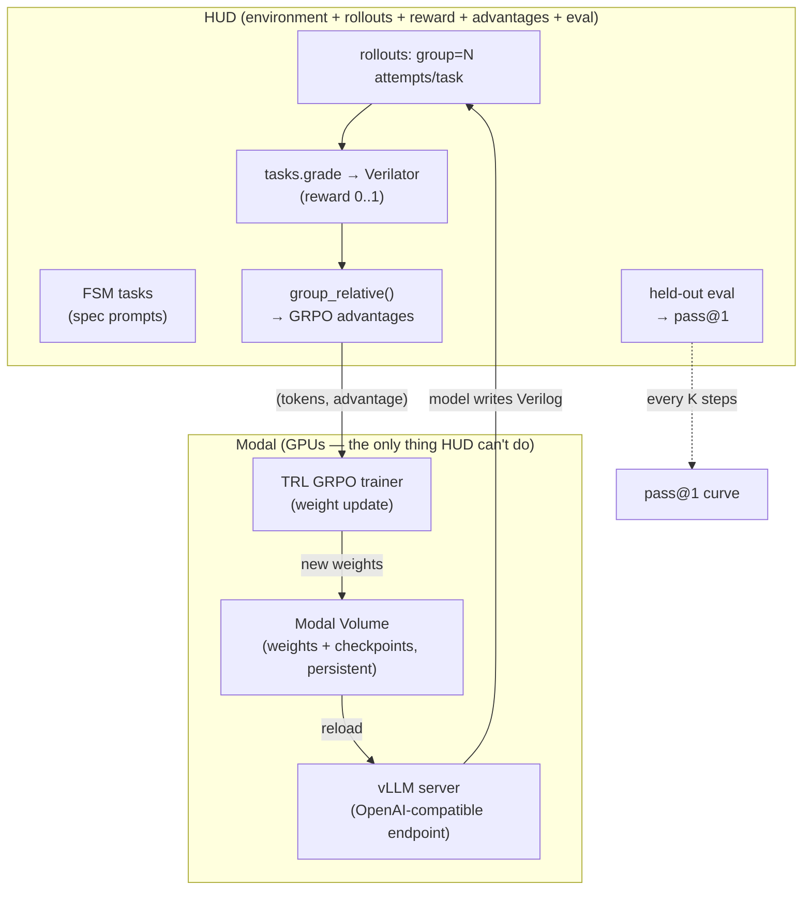
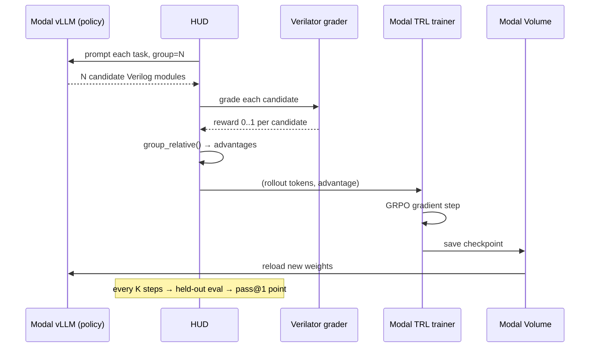
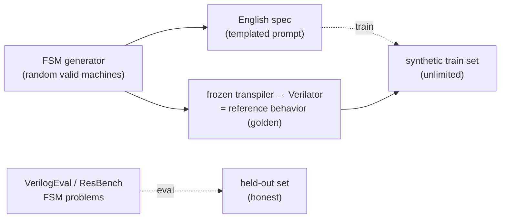

# rl-fsm — RL to make an open model write better FSM hardware

Train **Qwen2.5-Coder-7B** with RL so it writes correct FSM Verilog more often.
Reward = your calibrated Verilator grader. Loop = HUD (rollouts + reward + advantages)
+ Modal (GPU serve + GRPO weight update).

## The whole system

## The training loop (one iteration)

## Where tasks come from (data)

- **Train** on unlimited synthetic FSMs (our generator makes spec + golden).
- **Evaluate** on real held-out FSM problems so the curve is honest.
- RL needs **tasks + a checker**, never reference solutions handed to the model.

## What each platform does (no overlap confusion)

| Job | Tool |
|---|---|
| Environment, rollouts, reward, GRPO advantages, eval | **HUD** |
| GPUs: serve the model + apply the weight update | **Modal** |
| The model being trained | Qwen2.5-Coder-7B (open) |
| The reward function | your Verilator/Yosys grader |

## Success criterion
**Held-out pass@1 after RL > held-out pass@1 before RL**, on tasks never trained on.

## Build status
- [x] Auth: HUD (key loaded), Modal (`carl-4186`), Hugging Face (`verifast`)
- [x] Step 4: synthetic task generator (`tasks/generate.py`) — validated, makes spec+DSL+golden
- [x] Step 3: cosim reward grader (`hud_env/grader.py`) — CALIBRATED: golden=1.0, broken=0.3
- [x] Step 3: HUD environment (`hud_env/env.py`) — tasks.start/tasks.grade wired
- [x] Step 5: Modal vLLM serve (`modal/serve.py`) — written, NOT launched (GPU spend)
- [x] Step 6: Modal TRL GRPO trainer (`modal/train.py`) — written, NOT launched (GPU spend)
- [ ] Generate train/held-out splits + add real VerilogEval FSM tasks to held-out
- [ ] Baseline signal check (free) → then paid GPU loop

## Reward calibration (proven)
| candidate | compile | lint | behavior | reward |
|---|---|---|---|---|
| golden (correct) | 1.0 | 1.0 | 1.0 | **1.0** |
| broken (flipped output) | 1.0 | 1.0 | 0.0 | **0.3** |
